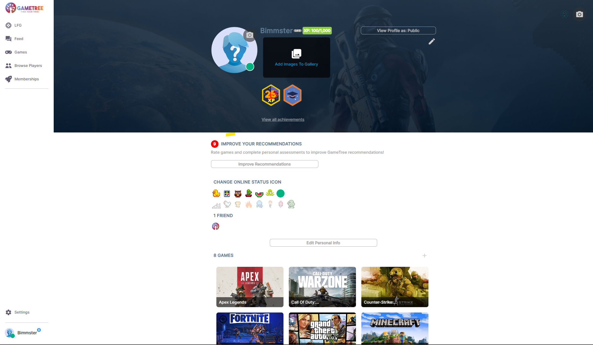
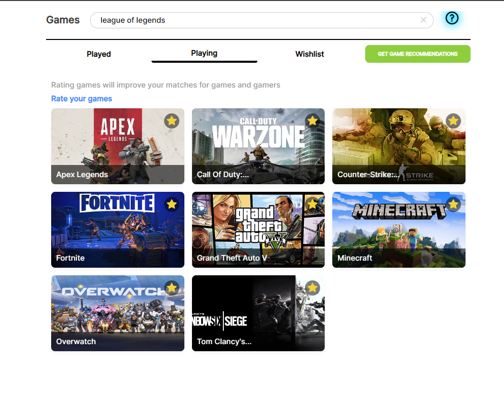
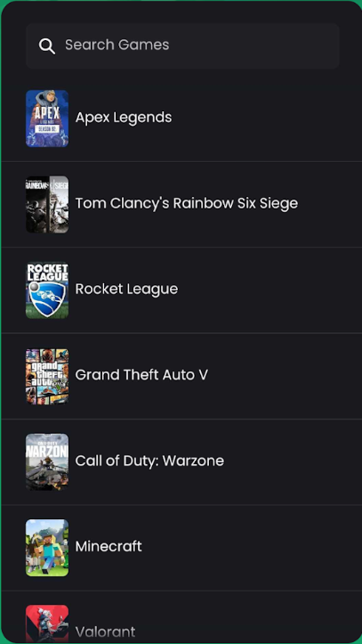
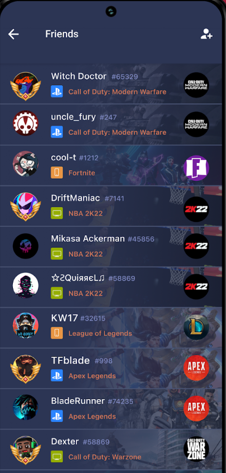
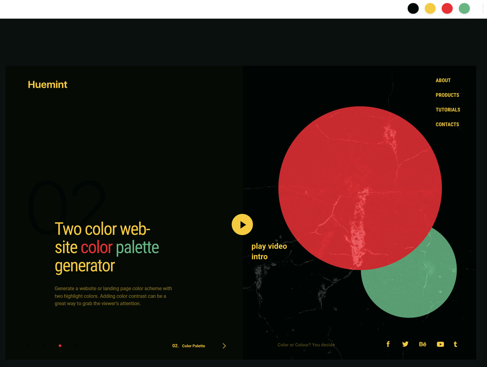
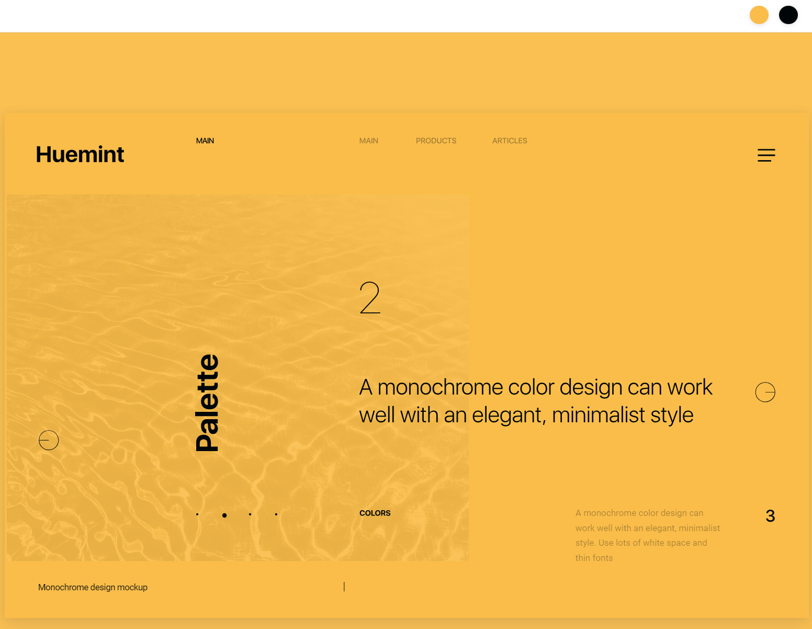
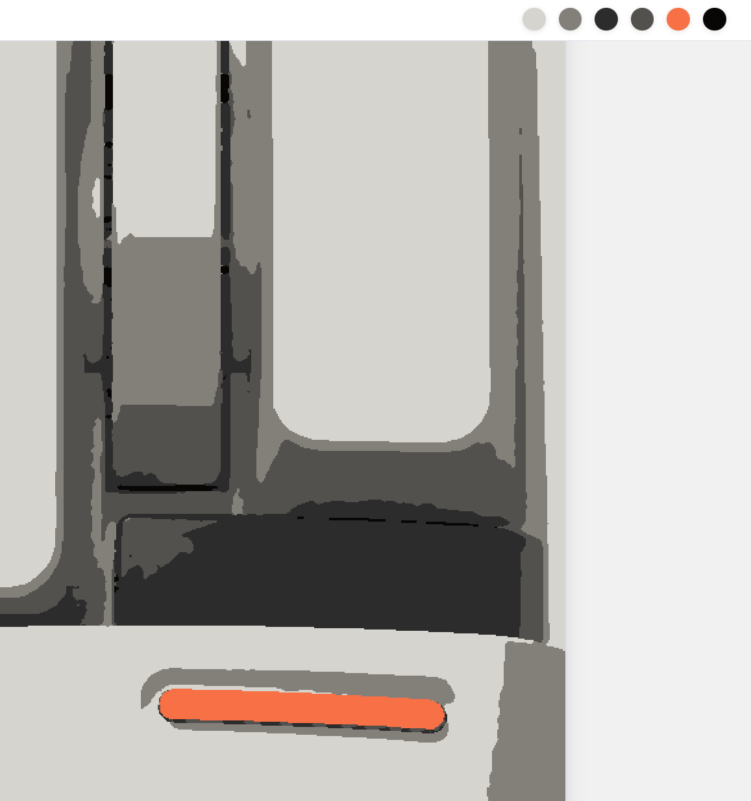

# Planning Sheet
## Goals list
### MVP
- Sign up (enter in userName, this will effectively create a profile for others to see)
- Search for games (add games to favorites and indicate platform)
- Search through profiles by name OR games owned (request friendship)
- My Profile: Edit username, schedule, accept or reject friendship requests
- My Friends: look through the profiles of friends (remove friend)
- My Games: view my favorite games (and remove them if desired)
### Stretch
- Basic game recommendations on your profile

## Planning steps
### Step-up
1. Make a navigation diagram
2. Build basic structure for a full stack app
### Frontend
1. Make files for all the pages. Fill them with place holder Components
2. Make the routes for them in the app.js
3. Make the files for the Contexts you think you'll need
### Backend
1. Make the first endpoints you think you'll need
2. Make the handler files for these endpoints
3. Make your account to use the API
4. Test the API with insomnia

## Chosen color palette
 </b>
1. #c72a2f
2. #050a05
3. #5d9e75
4. #edcd5f
5. #685f25
6. #4e3415
7. #2f3223
8. #7c8484
9. #3c4444

## Chosen API - "IGDB"
https://api-docs.igdb.com/#getting-started

## Nagivation tree
--HomePage
  |  -Login/Signin compenent
  |--Profile Page
  |   -Avatar component (Name, Icon, prefered plaform, prefered schedule)
  |   -My "playing" games component
  |     |--Game details page
  |   -Friends "playing (excluding my games)" games component
    |--Search Games Page
    |   -Seach bar component
    |   -Results component (click to add)
    |--Search User Page
    |   -Seach bar component
    |   -Results component (click to send friend request)
    |--Friends List Page
    |   -Sent friend request component
    |   -Received friend request component
    |   -Friend list component (unfriend button and click to see profile)

# Inspirations
## APIs
### option 1
https://www.igdb.com/api

### option 2
https://rawg.io/apidocs

## Layout inspirations
### Gametree
https://gametree.me/  

### Gamerlink
https://gamerlinkapp.com/  

### Plink
https://plink.gg/  

## Color palette inspirations
### option 1
https://huemint.com/website-2/#palette=000604-f4ca41-e63136-68b584  

### option 2
https://huemint.com/website-monochrome/#palette=fabd4a-000608  

### option 3
#d6d4ce
#83807a
#2c2c2c
#53514d
#f87045
#090705
 
 

